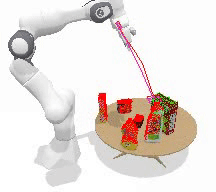
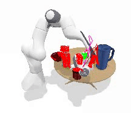
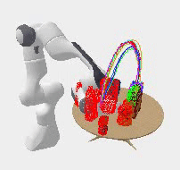
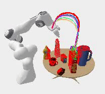

# Hierarchical Policies for Cluttered-Scene Grasping with Latent Plans


[[Website](https://sites.google.com/view/latent-grasping), [Paper](https://openreview.net/forum?id=DNcUeElhSPP)]


### Installation
```bash
git clone https://github.com/liruiw/HCG.git --recursive
```

0. Setup: Ubuntu 16.04 or above, CUDA 10.0 or above, python 2.7 / 3.6

1. * (Training) - Install [OMG](https://github.com/liruiw/OMG-Planner) submodule and reuse conda environment.
   * (Demo) - Install HCG inside a new conda environment
	    ```angular2html
	    conda create --name hcg python=3.6.9
	    conda activate hcg
	    pip install -r requirements.txt
	    ```
2. Install [PointNet++](https://github.com/liruiw/Pointnet2_PyTorch)

3. Download environment data with ```bash experiments/scripts/download_data.sh ```

### Pretrained Model Demo and Testing
0. Download pretrained models with ```bash experiments/scripts/download_model.sh ```
1. Demo model test ```bash experiments/scripts/test_demo.sh```


### Save Data and Offline Training
0. Download example offline data with ```bash experiments/scripts/download_offline_data.sh ``` The .npz dataset (saved replay buffer) can be found in data/offline_data and can be loaded for training.
1. To train offline latent plan embedding and low-level policy ```bash ./experiments/scripts/train_embedding_ray_offline.sh bc_embedding_low_level.yaml BC``` or without ray. Add pretrained model after the policy for continual training and finetuning.
2. To train offline joint embedding and latent plan sampler ```bash ./experiments/scripts/train_embedding_ray_offline.sh bc_sampler_restep.yaml BC```
3. To generate and save offline dataset ```bash ./experiments/scripts/train_ray_online_save_data.sh dqn_save_buffer.yaml DQN_HRL```.

### Online HRL Training
0. We use [ray](https://github.com/ray-project/ray) for parallel rollout and training. The training scripts might require adjustments based on the local machine. See ```config.py``` for some notes.
1. To train the latent critic online ```bash ./experiments/scripts/train_sampler_ray_online.sh dqn_critic_hrl.yaml DQN_HRL MODEL```. Use visdom and tensorboard to monitor.

### Testing
0. To test embedding and low-level policy ```bash experiments/scripts/test_ycb.sh demo_model_clutter  ```.


Example 1      |  Example 2
:-------------------------:|:-------------------------:
  |  


1. To test high-level sampler and critic  ```bash experiments/scripts/test_ycb_gen_12_mpc.sh demo_model_clutter ```


Example 1      |  Example 2
:-------------------------:|:-------------------------:
  |  


2. Testing only works with single GPU. Replace demo_model with trained model name. Logs and videos would be saved to ```output_misc```


### Note
0. Checkout ```core/test_realworld_ros_clutter.py``` for an example of real-world usages.
1. Related Works ([OMG](https://github.com/liruiw/OMG-Planner), [ACRONYM](https://github.com/NVlabs/acronym), [GA-DDPG](https://github.com/liruiw/GA-DDPG). [Unseen-Clustering](https://github.com/NVlabs/UnseenObjectClustering)).
2. To use the full Acronym dataset with Shapenet meshes, please follow [ACRONYM](https://github.com/NVlabs/acronym#using-the-full-acronym-dataset) to download the meshes and grasps and follow [OMG-Planner](https://github.com/liruiw/OMG-Planner#process-new-shapes) to process and save in ```/data```. ```filter_shapenet.json``` can then be used for training.
3. Please use Github issue tracker to report bugs. For other questions please contact [Lirui Wang](mailto:wangliruisz@gmail.com).

### File Structure
```angular2html
├── ...
├── HCG
|   |── data  # training data from ACRONYM dataset
|   |   |── grasps      # grasps of the objects
|   |   |── objects     # object meshes, sdf, urdf, etc
|   |   |── robots      # robot meshes, urdf, etc
|   |   |── hcg_scenes  # test scenes
|   |   └── ...
|   |── env # environment
|   |   |── env_planner      # interface for the expert planner
|   |   |── panda_cluttered_scene     # environment and task
|   |   └── panda_gripper_hand_camera      # franka panda with gripper and camera
|   |── OMG # expert planner submodule
|   |── experiments
|   |   |── config      # hyperparameters for training, testing and environment
|   |   |── scripts     # runable scripts for train/test/validate
|   |   |── model_spec     # network architecture spec
|   |   |── cfgs # experiment config
|   |   └── object_index      # object indexes used for experiments
|   |── core    # agents and learning
|   |   |──  train_online      # online training
|   |   |──  train_offline     # offline training
|   |   |──  test_offline     # testing and video recording
|   |   |──  network      # network architecture
|   |   |──  agent        # learner and loss
|   |   |──  replay memory       # replay buffer
|   |   |──  trainer       # ray-related training
|   |   |──  test_realworld_ros_clutter    # example real-world scripts
|   |   └── ...
|   |── output  # trained model
|   |── output_misc  # log and videos
|   └── ...
└── ...
```

### Citation
If you find HCG useful in your research, please consider citing:
```
@inproceedings{
anonymous2021hierarchical,
title={Hierarchical Policies for Cluttered-Scene Grasping with Latent Plans},
author={Anonymous},
booktitle={Submitted to 5th Annual Conference on Robot Learning },
year={2021},
url={https://openreview.net/forum?id=DNcUeElhSPP},
note={under review}
}
```

### License
The HCG is licensed under the [MIT License](LICENSE).
